# 🤖 2026 Agentic Profile: Diogo Catarino (@diocata)

<p align="center">
  
</p>

---

### 🧬 System Context
```yaml
identity:
  name: Diogo Catarino
  specialization: [Multi-Agent Orchestration, Full-Stack Architecture, Swift/iOS]
  workflow: Agentic-First (Cursor + Ghostty + Starship)
  location: Lisbon / Remote

core_directives:
  - "Architecting autonomous health-tech ecosystems (Health Wealth Hub)."
  - "Optimizing model-context protocols (MCP) for local tool integration."
  - "Building high-performance, minimalist software with intent."

active_stack:
  languages: [Swift, TypeScript, Python, Rust]
  frameworks: [Next.js, FastAPI, SwiftUI, LangGraph]
  infrastructure: [Supabase, Bun, Edge Functions]
```

---

### 🛠️ Problem-Solving Architecture

```mermaid
graph LR
    A[Problem] --> B{Agent Router}
    B --> C[Research Agent]
    B --> D[Coding Agent]
    C & D --> E[Eval Framework]
    E --> F[Verified Solution]
    style A fill:#24273a,stroke:#cad3f5
    style F fill:#24273a,stroke:#a6da95
```


---

### 📊 Performance Metrics
<p align="center">
  
  
</p>

---

<p align="center">
  <a href="https://linkedin.com/in/diogocatarino">
    
  </a>
  <a href="mailto:diogo@example.com">
    
  </a>
</p>

<p align="center">
  <sub>Built with intent. Optimized for agents. ⚡</sub>
</p>
